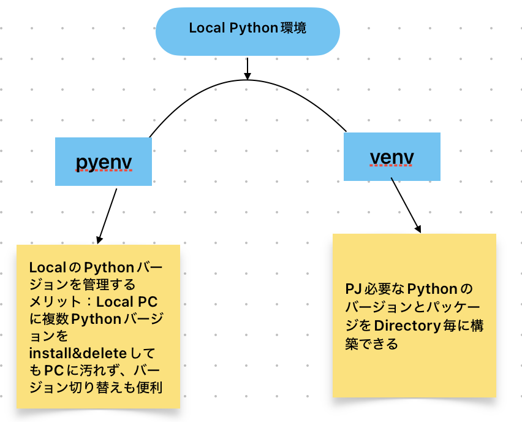

# Install

## 個人PCに簡単インストール場合

[公式サイト](https://www.python.org)からWindowsとmacOS用のPython installerをdownloadできます。downloadしたファイルを開き、画面の指示に従ってinstallしてください。

## Pythonランタイム環境を分離したい場合

そもそもなぜPythonランタイム環境分離必要でしょうか。以下の問題を解決したい場合Pythonランタイム環境分離することで簡単に解決できます。

* Project AはライブラリーXのバージョン1.xに依存するが、Project BはライブラリーXのバージョン2.xを必要とする、というジレンマを解消したい、依存ライブラリーが衝突してお互いに影響を与えるようなリスクを避けたい場合
* 開発者が複数のProjectを同時に対応する場合、Project使うpythonバージョンはそれぞれの場合
* 新しいパッケージを開発環境にのみ導入して検証を行う場合

仮想環境を作成及びパッケージの依存関係を管理するツールは主にvirtualenv、venv、buildoutが使われます。
また、異なるPython バージョンを管理し、切り替えるためのツールなら代表的なものはpyenvです。

個人PCで複数のProjectを開発する場合 [pyenv + venv]という案を紹介させて頂きたいです。
イメージとしては




### pyenvのinstall&使う方法
**pyenvのinstall:** macOSの場合Homebrewで簡単にインストール可能。

```
# install
brew install pyenv

# add pyenv to your shell profile configuration (e.g., .zshrc )
echo 'export PYENV_ROOT="$HOME/.pyenv"' >> ~/.zshrc
echo '[[ -d $PYENV_ROOT/bin ]] && export PATH="$PYENV_ROOT/bin:$PATH"' >> ~/.zshrc
echo 'eval "$(pyenv init -)"' >> ~/.zshrc

#Restart your shell or run source ~/.zshrc 
source ~/.zshrc 
```
**pyenvよく使うcmd**

```
# install Python using pyenv:
## version list
➜  ~ pyenv install --list | grep "3.11"
  3.11.0
  3.11-dev
  3.11.1
  3.11.2
  3.11.3
  3.11.4
  3.11.5
  3.11.6
  3.11.7

## install 
pyenv install 3.11.7
## Set Python Version. use global to set the installed Python version as the default:
pyenv global 3.11.7
```

### venv 仮想環境を作る

```
# python version 確認
python --version 
# 新しい仮想環境を作成します
python -m venv myenv
# 新しく作成した仮想環境をアクティブにする
##macOS / Linux:
source myenv/bin/activate

**アクティブした仮想環境おいて、pythonとpipは仮想環境のPythonインタープリタとパッケージを対象とするため、
パッケージをインストールすると、それらは仮想環境にのみインストールされますのでシステム全体のPython環境には影響を与えません。

#  仮想環境の終了
deactivate
````
