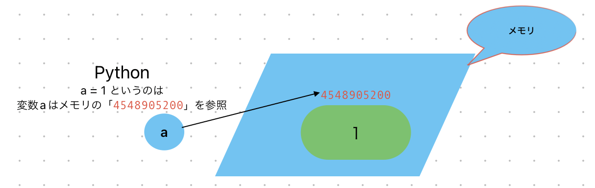

# Python基本ーレベルアップ

## 変数
Python に限らずほとんどのプログラミング言語では値を格納するために変数と呼ばれるものを使用します。
==実際に、Pythonのようなオブジェクト指向言語では、変数に値そのものが格納されるのではなく、変数の値を保存するメモリアドレスの「リファレンス」が格納されるということです。==


```
>>> a = 1
>>> id(a)
4548905200
>>> b = 1
>>> id(b)
4548905200
>>> c = 1
>>> id(c)
4548905200
>>> a = 3
>>> id(a)
4548905264
>>> id(b)
4548905200
```
## 可変・不可変
Pythonでは、すべての変数がオブジェクトへの参照になります。Pythonのすべてのオブジェクトは「値」、「データ型」、「ID」を持っています。
「値」が変更できるobjectは可変objectと言います。「値」が変更できないのは不可変object。

カテゴリ |　データ型 |
------------- | -------------
可変 | list, dict, set
不可変 | int, float, bool, str, tuple


```
⚪︎str
>>> str1 = "hi"
>>> str1
'hi'
>>> id(str1)
4542619440
>>> str1 += ", nanase" 
>>> str1
'hi, nanase'
>>> id(str1)
4540829296
※メモリアドレスの「リファレンス」が変更した

⚪︎list
>>> list1 = [1,2,3]
>>> list1
[1, 2, 3]
>>> id(list1)
4542837184
>>> list1.append(4)
>>> list1
[1, 2, 3, 4]
>>> id(list1)
4542837184

※メモリアドレスの「リファレンス」が変更なし
```

## 文字列の操作
* 連結：

```
文字列を連結するには + 演算子を使用します。
>>> str1 = "hello,"
>>> str2 = "world!"
>>> result = str1 + str2
>>> result
'hello,world!'

joinメソッドとリスト/タプルを使って連結する方法もありますね
>>> words = ["This", "is", "a", "list"]
>>> result = " ".join(words)
>>> result
'This is a list'
```
* 字列の繰り返し：文字列を繰り返すには * 演算子を使用します。

```
>>> repeated_str = "lucky star! " * 3  
>>> repeated_str
'lucky star! lucky star! lucky star! '
```
* 値の埋め込み

>sprintfを使う

```
>>> str_hello = "hello, %s"
>>> print(str_hello % "Tom")
hello, Tom
>>> "I am %s, %s yeas old" % ("Tom", 33)
'I am Tom, 33 yeas old'
```

>formatを使う

```
name = "John"
age = 25
message = "My name is {} and I'm {} years old.".format(name, age)
```

* 大文字・小文字変換：
upper()やlower()メソッドを使用して、文字列を大文字または小文字に変換できます。

```
>>> txt = "Hello, world!"
>>> upper_case = txt.upper()
>>> upper_case
'HELLO, WORLD!'
>>> lower_case = txt.lower()
>>> lower_case
'hello, world!'
```
* 先頭のみ大文字に変換： str.capitalize()

```
>>> "hello world".capitalize()
'Hello world'
```
* 各単語の先頭のみ大文字に変換（タイトルケース）： str.title()

```
>>> "hello world".title()
'Hello World'
```
* 空白の削除：strip()メソッドを使用して、文字列の先頭と末尾の空白を削除します。

```
>>> padded_text = "   Trim me   "
>>> trimmed_text = padded_text.strip()
>>> trimmed_text
'Trim me'
```
* 文字列の分割:split()メソッドを使用して文字列を分割

```
>>> sentence = "This is a sample sentence"
>>> words = sentence.split()
>>> words
['This', 'is', 'a', 'sample', 'sentence']
```

* 置換(replace) 

	* 文字列内の単一の部分文字列の置換：
	
```
>>> txt = "Hello, Tom"
>>> txt.replace("Tom", "Jack")
'Hello, Jack'
```
	* 大文字と小文字を区別せずに置換：
	
	```
	>>> import re
	>>> text = "Programming is fun, programming is challenging, PROGRAMMING is rewarding."
	>>> re.sub("programming", "coding", text, flags=re.IGNORECASE)
     'coding is fun, coding is challenging, coding is rewarding.'
	```

*  N文字目の文字の取得

```
>>> str1 = "This is my friend Tom."
>>> str1
'This is my friend Tom.'
>>> str1[0]
'T'
>>> str1[1]
'h'
>>> str1[-1]
'.'
>>> str1[0:4]
'This'
>>> str1[5:7]
'is'
```
*  検索

	* n 演算子:
	
	```
>>> text = "Hello, World!"
>>> "World" in text
True
```
	* find() メソッド:
	findは指定された部分文字列が最初に見つかる位置のインデックスを返します。見つからない場合は -1 を返します。
	
	```
	>>> text = "Hello, World!"
>>> text.find("World")
7
>>> text.find("dog")
-1
	```
	* index() メソッド:
	index() メソッドも find() と同様に、指定された部分文字列が最初に見つかる位置のインデックスを返しますが、見つからない場合には ValueError が発生します。
	
	```
	>>> text = "Hello, World!"
>>> text.index("World")
7
>>> text.index("dog")
Traceback (most recent call last):
  File "<stdin>", line 1, in <module>
ValueError: substring not found
	```
	* 規表現を使用した検索:re モジュールを使用して正規表現を使って検索することもできます。search() 関数は最初に一致する部分文字列を返します。
	
	```
	>>> import re
>>> text = "Python is powerful, Python is easy, Python is fun."
>>> re.search(r"Python", text)
<re.Match object; span=(0, 6), match='Python'>
	```

## 文字列に変換する

* intを文字列に変換する

```
>>> a = 1
>>> type(a)
<class 'int'>
>>> str_a = str(a)
>>> print(str_a)
1
>>> type(str_a)
<class 'str'>
```

* listを文字列に変換する

	* join
	
	```
	>>> my_list = ["apple", "banana", "orange"]
>>> ", ".join(my_list)
'apple, banana, orange'
	```
	
	* スト内包表記と str() 関数:
	
	```
	>>> my_list = ["apple", "banana", "orange"]
>>> ", ".join([str(item) for item in my_list])
'apple, banana, orange'
	```
	* map() と str() を組み合わせる:
	
	```
	>>> my_list = ["apple", "banana", "orange"]
>>> ", ".join(map(str, my_list))
'apple, banana, orange'
	```
	
* dictを文字列に変換する

	* str() 関数を使用する:
	
	```
	>>> my_dict = {'name': 'John', 'age': 30, 'city': 'New York'}
>>> str(my_dict)
"{'name': 'John', 'age': 30, 'city': 'New York'}"
	```
	* json.dumps() を使用する:
	
	```
	>>> import json
>>> my_dict = {'name': 'John', 'age': 30, 'city': 'New York'}
>>> json.dumps(my_dict)
'{"name": "John", "age": 30, "city": "New York"}'
	```
	


	
