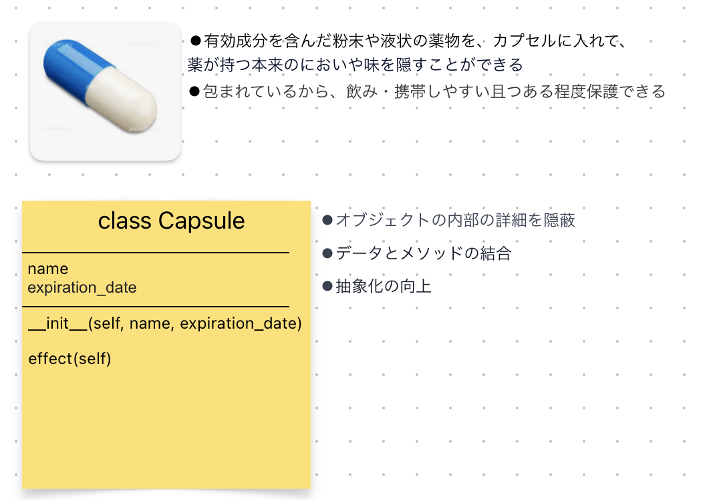

# Python：function＆class

## funciton
**◾️基本的な関数の構文:**

* def: 関数の定義用キーワード。
* function_name: 関数の名前。
* parameter1, parameter2, ...: 関数の引数。関数に渡す値を指定します。
* return result: 関数が結果を返す場合、return 文を使用して返り値を指定します。return を省略すると、関数は None を返します。

```
def function_name(parameter1, parameter2, ...):
    # 関数の本体
    # 処理1
    # 処理2
    # ...
    return result  # 結果を返す（return文は省略可能）
```

**◾️可変長引数:\*args, \**kwargs**

* \*args:  複数の引数をタプルとして受け取る
* \**kwargs: 複数のキーワード引数を辞書として受け取る

```
# 財布中のコインを計算する
>>> def count_wallet(*args):
...     result = 0
...     for i in args:
...         result += i
...     return result 
... 
>>> count_wallet(1, 5, 10, 50, 100)
166

# 財布を確認する
>>> def confirm_wallet(**kwargs):
...     for k, v in kwargs.items():
...         print("%s:%s個" % (k, v))
... 
d = {"1円":3, "5円":3, "10円":5}
>>> confirm_wallet(**d)
1円:3個
5円:3個
10円:5個
```

## class
**◾️基本的なクラスの構文:**

* class: クラスの定義用キーワード。
* ClassName: クラスの名前。
* __init__(self, parameter1, parameter2, ...): インスタンスの初期化メソッド。クラスのインスタンスが生成される際に自動的に呼び出されます。
* self: インスタンス自体を指すキーワード。メソッド内で使用され、メソッドが呼び出されたインスタンスにアクセスするために利用されます。
* attribute1, attribute2, ...: クラスの属性（メンバ変数）。インスタンスごとに異なる値を持つことができます。
* method1(self), method2(self, parameter): クラスのメソッド。クラスに固有の操作を定義します。

```
class ClassName:
    def __init__(self, parameter1, parameter2, ...):
        # インスタンスの初期化メソッド
        # 初期化時に実行される処理を記述
        self.attribute1 = parameter1
        self.attribute2 = parameter2
        # ...

    def method1(self):
        # クラスのメソッド1
        # インスタンス変数や他のメソッドを利用して処理を実行
        pass

    def method2(self, parameter):
        # クラスのメソッド2
        # パラメータを受け取り、処理を実行
        pass
```
**◾️カプセル化:**
>カプセルと言えば、カプセル状のお薬をイメージする人が多いと思います。オブジェクト指向プログラミングにおいて、カプセル化はデータとそのデータを操作するメソッド（関数）を一つの単位にまとめ、外部からは隠蔽する仕組みです。




**◾️継承:**
>継承とは、
クラス（class）というプログラミングの基本的な構造を拡張し、再利用性を高めるための概念です。継承は、既存のクラス（親クラスまたは基底クラス）を使用して新しいクラス（子クラスまたは派生クラス）を作成するプロセスです。

* 基本的な継承の構文

```
class ParentClass:
    # 親クラスの定義

class ChildClass(ParentClass):
    # 子クラスの定義

# 例：
class Animal:
    def __init__(self, name):
        self.name = name

    def speak(self):
        raise NotImplementedError("Subclasses must implement this method")

class Dog(Animal):
    def speak(self):
        return f"{self.name} says Woof!"

class Cat(Animal):
    def speak(self):
        return f"{self.name} says Meow!"

# Animalクラスを継承したDogとCatクラスを使用
dog = Dog(name="Buddy")
cat = Cat(name="Whiskers")

print(dog.speak())  # Buddy says Woof!
print(cat.speak())  # Whiskers says Meow!

```

**◾️ポリモーフィズム（polymorphism）:**

ポリモーフィズムは主に以下の2つの形態
>メソッドのオーバーライド、親クラスが持つメソッドを子クラスが再定義することを指します。子クラスは同じメソッド名を持ちながら、親クラスのメソッドをオーバーライドして新しい動作を提供します。

```
class Animal:
    def run(self):
        return "動物は走る!"

class Horse(Animal):
    def run(self):
        return "馬はドドドドッというリズムで走る！"

class Kangaroo(Animal):
    def run(self):
        return "カンガルーは二足跳躍して走る！"

def animal_ run(animal_instance):
    # ポリモーフィズムにより、異なるクラスのインスタンスを同じメソッドで扱う
    return animal_instance.run()

# Animalクラスを継承したHorseとKangarooクラスのインスタンスを作成
horse = Horse()
kangaroo = Kangaroo()

# 同じメソッドを使って異なるクラスのインスタンスにアクセス
print(animal_run(horse))  # 馬はドドドドッというリズムで走る！
print(animal_run(kangaroo))  # カンガルーは二足跳躍して走る！

```

